# Unidad 9: MPI

## Contenido de la unidad

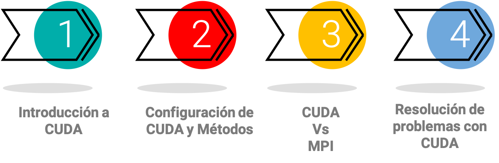

## Introducción a MPI4PY
### Definición de MPI4PY

- MPI es un estándar de comunicación entre procesos para sistemas distribuidos y paralelos.

- MPI4PY proporciona una interfaz para MPI (Message Passing Interface) en Python.

- Permite a los desarrolladores de Python crear programas paralelos y distribuidos.

- Ofrece una amplia gama de funciones y utilidades para la comunicación entre procesos.

- Proporciona soporte para diferentes implementaciones de MPI.

### Comparando a MPI4PY con Multiprocessing

::::{grid}
:gutter: 3

:::{grid-item-card}
:class-body: text-right
:class-header: bg-light text-center
```{dropdown} Ventajas de MPI4PY
- Estándar de comunicación para sistemas distribuidos y paralelos.

- Ofrece una amplia gama de funciones y utilidades para la comunicación entre procesos.

- Proporciona soporte para diferentes implementaciones de MPI.
```
:::

:::{grid-item-card}
:class-body: text-right
:class-header: bg-light text-center
```{dropdown} Desventajas de MPI4PY
- Requiere conocimiento de MPI para utilizarlo de manera efectiva.

- La implementación y configuración puede ser más compleja que con otras bibliotecas.

- No viene incluido por defecto en la biblioteca estándar de Python.
```
:::

::::


::::{grid}
:gutter: 3

:::{grid-item-card}
:class-body: text-right
:class-header: bg-light text-center
```{dropdown} Ventajas de Multiprocessing
- Incluido en la biblioteca estándar de Python.

- Ofrece una interfaz de programación sencilla y coherente.

- Es fácil de utilizar para problemas sencillos de paralelización.
```
:::

:::{grid-item-card}
:class-body: text-right
:class-header: bg-light text-center
```{dropdown} Desventajas de Multiprocessing
- No está diseñado específicamente para sistemas distribuidos.

- No proporciona la misma funcionalidad para la comunicación entre procesos que MPI4PY.

- No es tan escalable como MPI4PY para aplicaciones de alta demanda computacional.
```
:::

::::

## Instalación de MPI4PY


- Descargar el instalador desde:
<a href="https://www.microsoft.com/en-us/download/details.aspx?id=100593" target="_blank">https://www.microsoft.com/en-us/download/details.aspx?id=100593</a>

- Seleccionar .exe

- Instalar en la ruta por defecto: 
C:\Program Files\Microsoft MPI\

- Agregar en las variables de usuario:
C:\Program Files\Microsoft MPI\Bin

- Ya en su ambiente de anaconda, instalar la librería:
pip install mpi4py

- Verificar si está funcionando, ejecutando en la terminal del ambiente donde se instaló:
  ```bash
  mpiexec -n 4 python -c "from mpi4py import MPI; comm = MPI.COMM_WORLD; print('Hola desde el proceso', comm.rank)"

- Salida esperada:
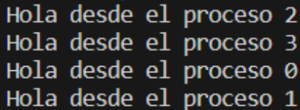

## Programación con MPI4PY
### Hola Mundo

```{dropdown} Comunicación entre procesos en MPI.COMM_WORLD
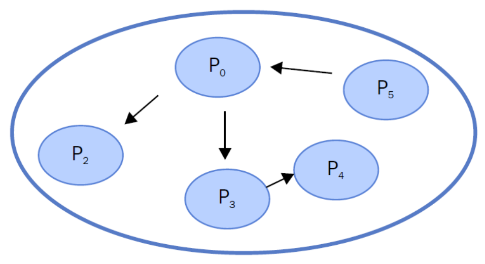
```

- En MPI, los procesos se identifican por una secuencia de enteros positivos llamados rangos.

- La función "Get_rank()" de MPI devuelve el rango del proceso que la llamó.

- El argumento "comm" en "Get_rank()" es un comunicador que define su propio conjunto de procesos que pueden comunicarse entre sí.

- El código muestra cómo obtener e imprimir el rango del proceso actual.

- Cada proceso en la ejecución de MPI corre el mismo binario compilado y recibe las mismas instrucciones.

```{tip}
- <a href="https://drive.google.com/drive/folders/1DefqxV-zYbB2pSy_Dpl5fbWD0TH3KDWF?usp=sharing" target="_blank">Acceder a carpeta de archivos Python</a>

- Ver el archivo de Python: `1-HolaMundoConMPI.py`

- Compilar usando:

  ```bash
  mpiexec -n 5 python .\1-HolaMundoConMPI.py
```

### Comunicación punto a punto

```{dropdown} El protocolo de transmisión de envío/recepción
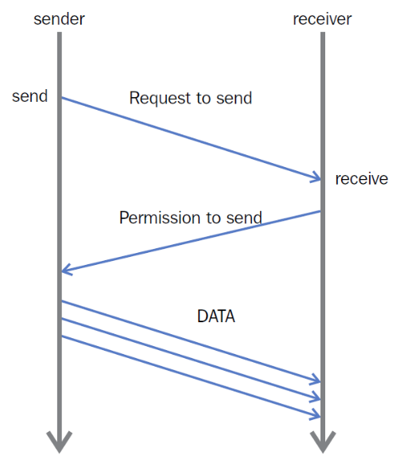
```

- MPI4py es una biblioteca que permite la comunicación entre procesos en programación paralela mediante MPI. 

- Esta comunicación se realiza a través de un comunicador (Comm) que agrupa los procesos participantes. 

- Cada proceso posee un identificador único llamado "rank". 

- Para enviar datos, se utiliza la función comm.send(), especificando el dato y el proceso receptor. Para recibir datos, se usa la función comm.recv(), indicando el proceso emisor.

```{tip}
- <a href="https://drive.google.com/drive/folders/1DefqxV-zYbB2pSy_Dpl5fbWD0TH3KDWF?usp=sharing" target="_blank">Acceder a carpeta de archivos Python</a>

- Ver el archivo de Python: `2-ComunicacionPuntoAPunto.py`

- Compilar usando:

  ```bash
  mpiexec -n 9 python .\2-ComunicacionPuntoAPunto.py
```

### Evitar Problemas De Punto Muerto

- **Métodos de Comunicación**: comm.send() y comm.recv() son funciones bloqueantes en mpi4py.

- **Problema de Deadlock**: si dos procesos llaman a comm.recv() antes que comm.send(), pueden bloquearse mutuamente causando un deadlock.

- **Solución Efectiva**: hacer las funciones de envío y recepción asimétricas o utilizar la función comm.sendrecv().

- **Función Sendrecv**: unifica el envío y recepción de mensajes en una única llamada, evitando el interbloqueo.

```{tip}
- <a href="https://drive.google.com/drive/folders/1DefqxV-zYbB2pSy_Dpl5fbWD0TH3KDWF?usp=sharing" target="_blank">Acceder a carpeta de archivos Python</a>

- Ver el archivo de Python: `3-EvitarProblemasDePuntoMuerto.py`

- Compilar usando:

  ```bash
    mpiexec -n 9 python .\3-EvitarProblemasDePuntoMuerto.py

- Ver el archivo de Python: `4-EvitarProblemasDePuntoMuertoOp2.py`

- Compilar usando:

  ```bash    
    mpiexec -n 9 python .\4-EvitarProblemasDePuntoMuertoOp2.py

```

### Comunicación colectiva usando broadcast
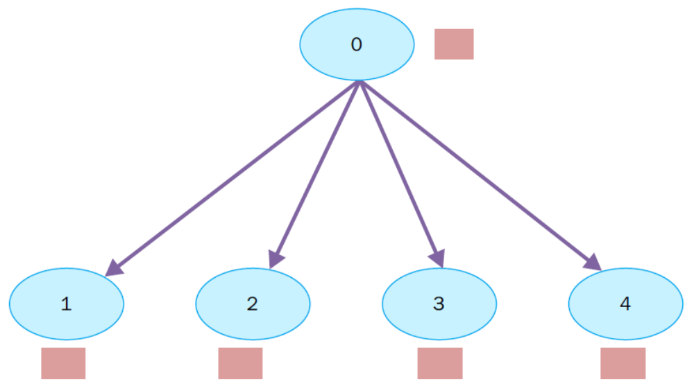
Transmisión de datos del proceso 0 a los procesos 1, 2, 3 y 4.

```{tip}
- <a href="https://drive.google.com/drive/folders/1DefqxV-zYbB2pSy_Dpl5fbWD0TH3KDWF?usp=sharing" target="_blank">Acceder a carpeta de archivos Python</a>

- Ver el archivo de Python: `5-ComunicacionColectivaBroadcast.py`

- Compilar usando:

  ```bash
    mpiexec -n 9 python .\5-ComunicacionColectivaBroadcast.py
```

### Comunicación colectiva mediante dispersión (scatter)
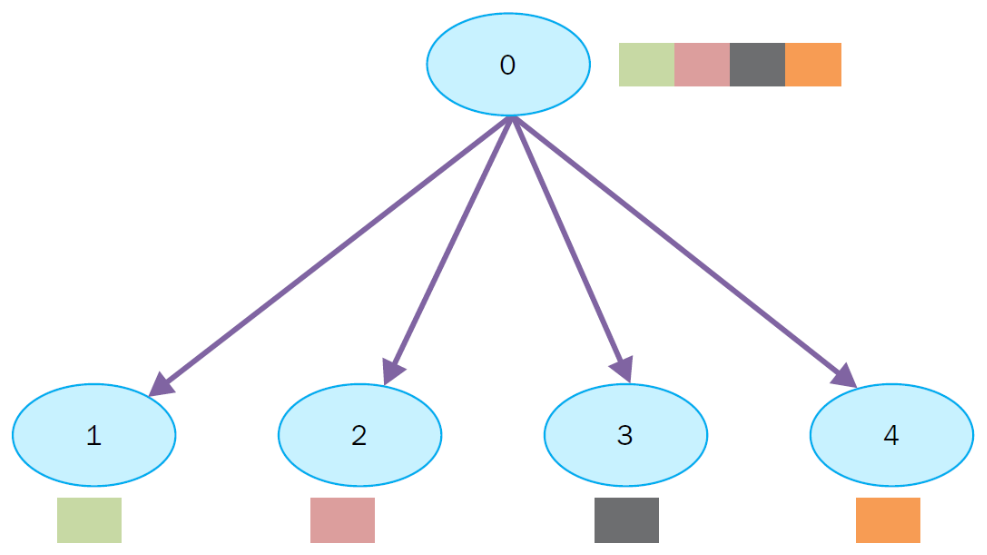
Dispersión de datos del proceso 0 a los procesos 1, 2, 3, 4

```{tip}
- <a href="https://drive.google.com/drive/folders/1DefqxV-zYbB2pSy_Dpl5fbWD0TH3KDWF?usp=sharing" target="_blank">Acceder a carpeta de archivos Python</a>

- Ver el archivo de Python: `6-ComunicacionColectivaScatter.py`

- Compilar usando:

  ```bash
    mpiexec -n 10 python .\6-ComunicacionColectivaScatter.py
```

### Comunicación colectiva utilizando reunir (gather)
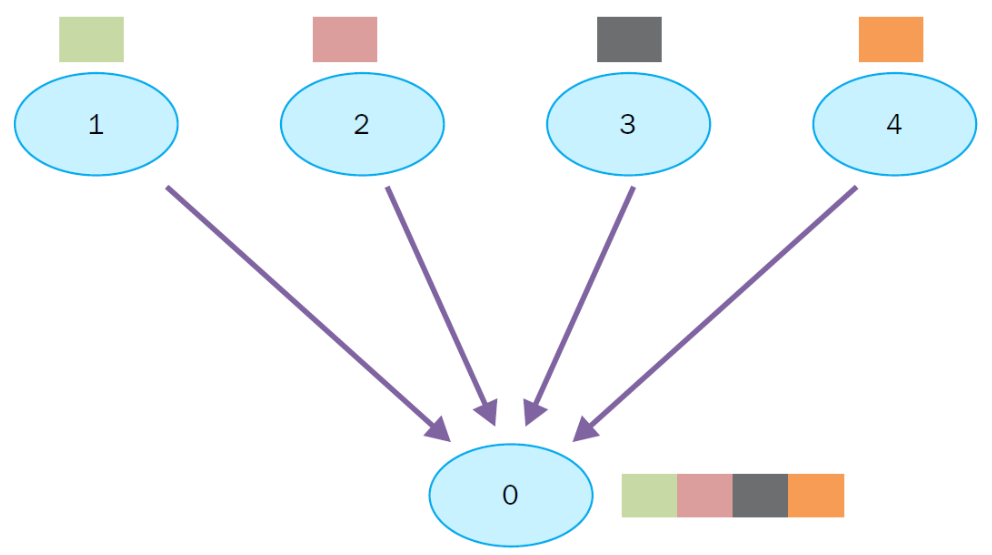
Recopilación de datos de los procesos 1, 2, 3, 4

```{tip}
- <a href="https://drive.google.com/drive/folders/1DefqxV-zYbB2pSy_Dpl5fbWD0TH3KDWF?usp=sharing" target="_blank">Acceder a carpeta de archivos Python</a>

- Ver el archivo de Python: `7-ComunicacionColectivaGather.py`

- Compilar usando:

  ```bash
    mpiexec -n 5 python .\7-ComunicacionColectivaGather.py
```

### Comunicación colectiva usando Alltoall
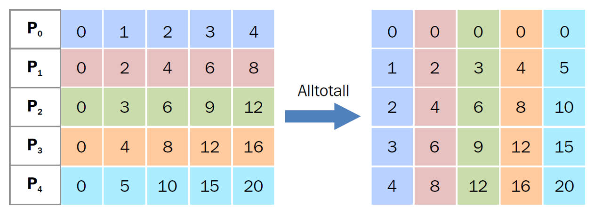
La comunicación colectiva Alltoall

```{tip}
- <a href="https://drive.google.com/drive/folders/1DefqxV-zYbB2pSy_Dpl5fbWD0TH3KDWF?usp=sharing" target="_blank">Acceder a carpeta de archivos Python</a>

- Ver el archivo de Python: `8-ComunicacionColectivaAllToAll.py`

- Compilar usando:

  ```bash
    mpiexec -n 5 python .\8-ComunicacionColectivaAllToAll.py
```

## Multiplicación de matrices

### Entendiendo la multiplicación de matrices: Objetivo
Se desea multiplicar las matrices A y B, lo cual debería generar una matriz nueva C
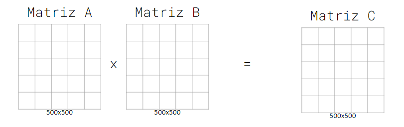

### Entendiendo la multiplicación de matrices: Broadcast
Desde el proceso 0 se transmite la matriz B a todos los procesos
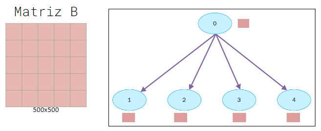

### Entendiendo la multiplicación de matrices: Scatter
Cada proceso recibe una subsección de A (100x500)
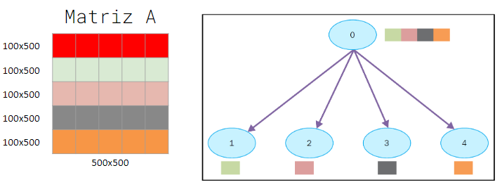
Comunicación colectiva mediante dispersión (scatter)

### Entendiendo la multiplicación de matrices: Multiplicando
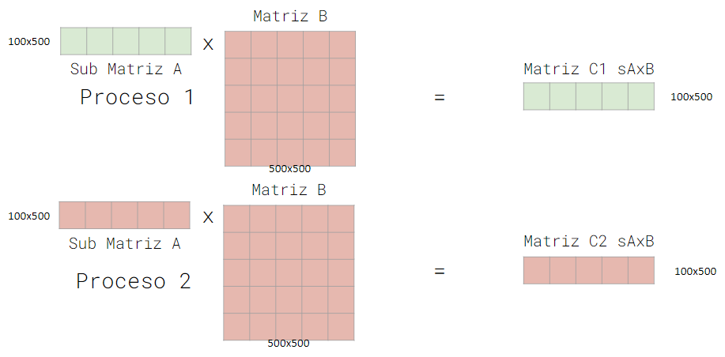

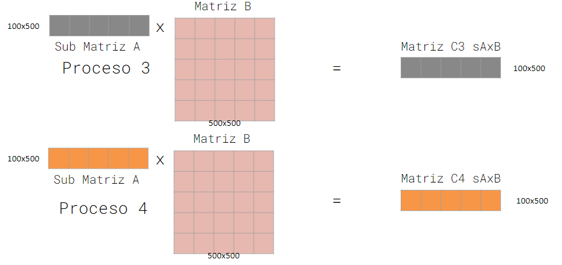

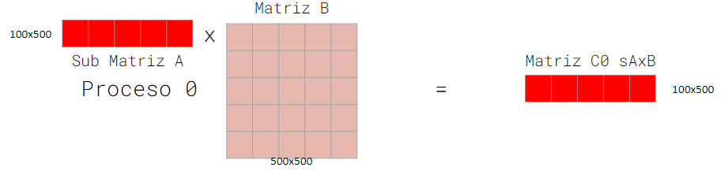

### Entendiendo la multiplicación de matrices Gather (reuniendo)
Se recogen en el proceso 0 los resultados de la multiplicación de todos los procesos
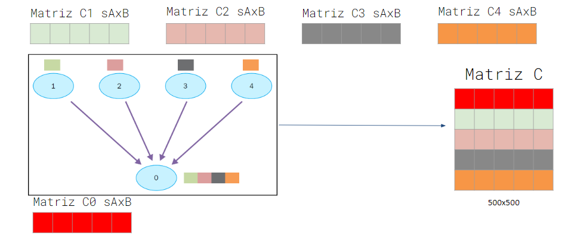

### Programando la multiplicación de matrices

Multiplicación de matrices

```{tip}
- <a href="https://drive.google.com/drive/folders/1DefqxV-zYbB2pSy_Dpl5fbWD0TH3KDWF?usp=sharing" target="_blank">Acceder a carpeta de archivos Python</a>

- Ver el archivo de Python: `9-MultiplicaciónDeMatrices.py`

- Compilar usando:

  ```bash
    mpiexec -n 4 python .\9-MultiplicaciónDeMatrices.py

- Ver el archivo de Python: `9-MultiplicaciónDeMatrices2.py`

- Compilar usando:

  ```bash
    mpiexec -n 4 python .\9-MultiplicaciónDeMatrices2.py

- Ver el archivo de Python: `9-MultiplicaciónDeMatrices3.py`

- Compilar usando:

  ```bash
    mpiexec -n 4 python .\9-MultiplicaciónDeMatrices3.py  

- Ver el archivo de Python: `9-MultiplicaciónDeMatrices4.py`

- Compilar usando:

  ```bash
    mpiexec -n 5 python .\9-MultiplicaciónDeMatrices4.py            
```

## Vista del procesamiento en paralelo en acción

- Ver administrador de tareas

- Ver temperatura del procesador - Ventilador

## Recursos
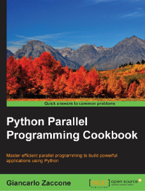

Ver el Chapter 3: Process-based Parallelism. Páginas de la 97 a la 126.

```{tip}
- <a href="https://drive.google.com/drive/folders/14rqT_OEtGkVUhYAtlXyjMamBwHZDFIRM?usp=sharing" target="_blank">Notebooks (recursos para estudiar)</a>
```

## Taller y Quiz

```{tip}
Ver la subsección **Evaluemos lo aprendido!!**
```
