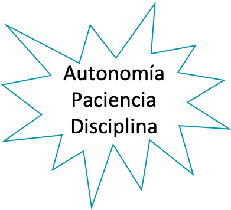
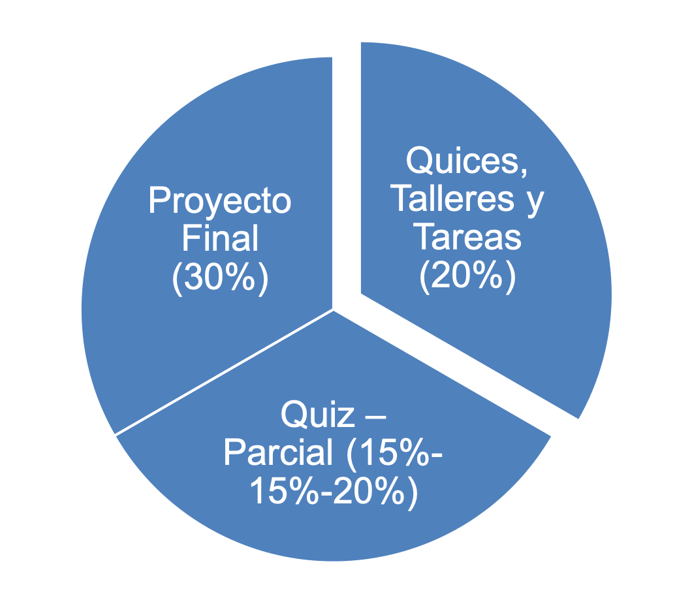

# Programación Concurrente y Distribuida

## El equipo!! 🦾🧠

::::{grid}
:gutter: 3

:::{grid-item-card} Ph.D. Reinel Tabares
:class-body: text-center
:class-header: bg-light text-center

```{image} images/rts.png
:height: 100
:class: rounded
```
^^^
```{only} html
[](mailto:reinel.tabares@ucaldas.edu.co)
```
:::

:::{grid-item-card} Johan 🍍
:class-body: text-center
:class-header: bg-light text-center
```{image} images/jpd.png
:height: 100
:class: rounded
```
^^^
```{only} html
[](mailto:johan.pinad@autonoma.edu.co)
```
:::

:::{grid-item-card} Brayan Arteaga
:class-body: text-center
:class-header: bg-light text-center
```{image} images/hba.png
:height: 100
:class: rounded
```
^^^
```{only} html
[](mailto:arteagabrayan99ah@gmail.com)
```
:::
::::


::::{grid} 2
:reverse:

:::{grid-item}
:columns: 4
:class: sd-m-auto


:::

:::{grid-item}
:columns: 8
:class: sd-fs-7

Facultad de ingeniería, Ingeniería de Sistemas

**Ph. D. Reinel Tabares Soto**

* Ingeniero Electrónico -  Universidad Nacional de Colombia
* Ingeniero de Sistemas - Universidad de Caldas
* Magister en Automatización Industrial - Universidad Nacional de Colombia
* Especialista en Deep Learning - DeepLearning.AI
* Doctor en Ingeniería - Universidad Autónoma de Manizales

% The SVG rendering breaks latex builds for the GitHub badge, so only include in HTML

```{only} html
[](https://github.com/BioAITeamLearning)
[](https://scholar.google.es/citations?user=_8F9RPQAAAAJ&hl=es)
[](https://orcid.org/0000-0002-4978-5211)
[](https://www.researchgate.net/profile/Reinel-Tabares-Soto)
```

:::

::::

---

## Objetivos del curso:

Proporcionar los conceptos y conocimientos necesarios para resolver problemas de programación distribuida y paralela; se concentrará la base de programación algorítmica, y los problemas de ingeniería asociados con el desarrollo de aplicaciones paralelas, distribuidas y concurrentes.

---

## Contenido del curso

::::{grid} 1 1 3 3
:class-container: text-center
:gutter: 3

:::{grid-item-card}
:link: Unidad1
:link-type: doc
:class-header: bg-light

**Unidad 1 📡**
^^^

Clusters en computación paralela/distribuida
:::

:::{grid-item-card}
:link: Unidad2
:link-type: doc
:class-header: bg-light

**Unidad 2 🏛️**
^^^

Arquitecturas para computación paralela
:::

:::{grid-item-card}
:link: Unidad3
:link-type: doc
:class-header: bg-light

**Unidad 3 🎯**
^^^

Métricas de desempeño
:::

:::{grid-item-card}
:link: Unidad4
:link-type: doc
:class-header: bg-light

**Unidad 4 🧵**
^^^

Manejo de hilos y procesos
:::

:::{grid-item-card}
:link: Unidad5
:link-type: doc
:class-header: bg-light

**Unidad 5 🚦**
^^^

Hilos 2.0 y Sockets
:::

:::{grid-item-card}
:link: Unidad6
:link-type: doc
:class-header: bg-light

**Unidad 6 💻**
^^^

Infraestructura de cluster
:::

:::{grid-item-card}
:link: Unidad7
:link-type: doc
:class-header: bg-light

**Unidad 7 ⏳**
^^^

Multiprocessing
:::

:::{grid-item-card}
:link: Unidad8
:link-type: doc
:class-header: bg-light

**Unidad 8 ⚡️**
^^^

Message Passing Interface (MPI)
:::

:::{grid-item-card}
:link: Unidad9
:link-type: doc
:class-header: bg-light

**Unidad 9 🐆**
^^^

Compute Unified Device Architecture (CUDA)
:::


::::

---

## Información del curso

- Horarios de clases: martes (2pm a 4pm) y jueves (7am a 9:30am)
- La **dedicación** de tiempo es la base para completar con éxito el curso


<div style="text-align: center;">
  
</div>

---

## Bibliografía
Estas son algunas de las referencias usadas para este curso, vuelve pronto para encontrar más contenido.

::::{card-carousel} 2

:::{card}
:margin: 3
:class-body: text-center
:class-header: bg-light text-center

```{image} images/bib1.png
:height: 300
```

:::

:::{card}
:margin: 3
:class-body: text-center
:class-header: bg-light text-center

```{image} images/bib2.png
:height: 300
```
:::

:::{card}
:margin: 3
:class-body: text-center
:class-header: bg-light text-center

```{image} images/bib3.png
:height: 300
```

:::

:::{card}
:margin: 3
:class-body: text-center
:class-header: bg-light text-center

```{image} images/bib4.png
:height: 300
```

:::

::::

---

## Reglas de Juego 🕹️📏

* Clases magistrales para conceptualización del tema
* Quices
* Trabajo en clase y actividades:  Notebooks y repositorios
* Proyecto Final


::::{grid} 1

:::{grid-item}
:columns: 8
:class: sd-m-auto


:::
::::

---

## Manos a la Obra! 📚💻🐍

<div style="text-align: center;">
  
</div>

## ¿Qué vamos a ver durante el curso?

```{tableofcontents}
```